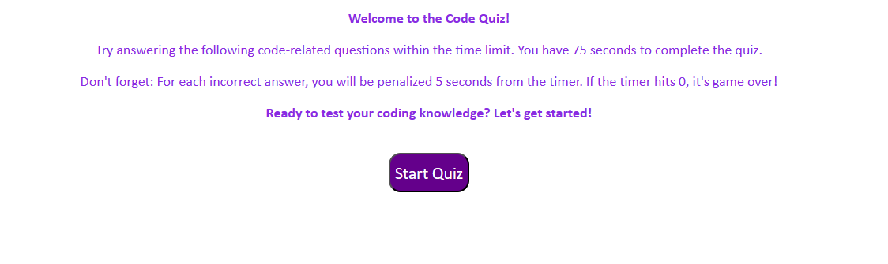

## codeQuiz
# What was your motivation? 
My motivation was to improve my javascript skills.
# Why did you build this project? 
To showcase the skills learned through the videos, activities, and truly refine my googling abilities.
# What problem does it solve? 
It allows me to generate a timed quiz which could be very fun and useful in the real world.
# What did you learn? 
I learned that how to create event handlers, gained a deeper understanding of functions, variables, and the power of JS.
# What makes your project stand out? 
I incorporated foundational questions related to JS and overall had some fun with CSS and JS.

## Screenshot
